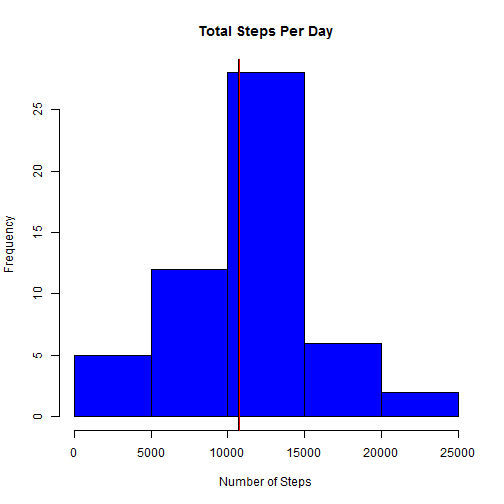
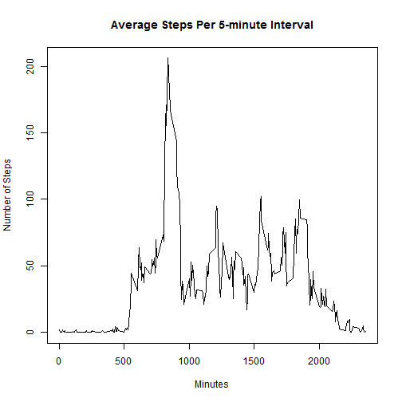
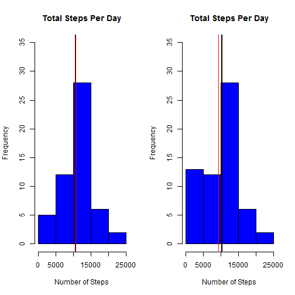
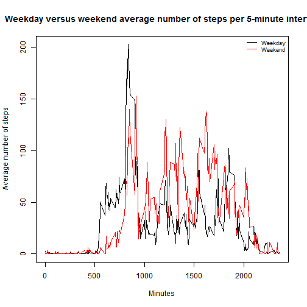

---
title: "RR Peer Assessment 1"
author: "Christa Smolarchuk"
date: "September 14, 2015"
output: html_document
--
#Reproducible Research: Peer Assignment 1

This assignment uses data from a personal activity monitoring device. The device collected the number of steps taken in a 5 minute interval for two months from October to November, 2012.  

##Loading and preprocessing the data

```r
data<-read.csv("activity.csv")
head(data)
```

```
##   steps       date interval
## 1    NA 2012-10-01        0
## 2    NA 2012-10-01        5
## 3    NA 2012-10-01       10
## 4    NA 2012-10-01       15
## 5    NA 2012-10-01       20
## 6    NA 2012-10-01       25
```

Remove missing values from the data set

```r
dat<-subset(data, complete.cases(data))
head(dat)
```

```
##     steps       date interval
## 289     0 2012-10-02        0
## 290     0 2012-10-02        5
## 291     0 2012-10-02       10
## 292     0 2012-10-02       15
## 293     0 2012-10-02       20
## 294     0 2012-10-02       25
```

##What is mean total number of steps taken per day?

1.Calculate the total number of steps taken per day

```r
steps_per_day<-aggregate(steps~date, data=dat, sum)
```

2. Make a histogram of the total number of steps taken each day

```r
hist(steps_per_day$steps, main="Total Steps Per Day", xlab="Number of Steps", col="blue")
abline(v = median(steps_per_day$steps), col = "black", lwd = 2)
abline(v = mean(steps_per_day$steps), col = "red", lwd = 1)
```

 

3. Calculate and report the mean and median of the total number of steps taken per day

```r
round(mean(steps_per_day$steps), digits=0)
```

```
## [1] 10766
```

```r
round(median(steps_per_day$steps), digits=0)
```

```
## [1] 10765
```

##What is the average daily activity pattern?

1. Make a time series plot (i.e. type = "l") of the 5-minute interval (x-axis) and the average number of steps taken, averaged across all days (y-axis)

```r
interval_per_day<-aggregate(steps~interval, data=dat, mean)
plot(interval_per_day$interval, interval_per_day$steps, type="l", main="Average Steps Per 5-minute Interval", xlab="Minutes", ylab="Number of Steps")
```

 

2. Which 5-minute interval, on average across all the days in the dataset, contains the maximum number of steps?

```r
print(interval_per_day[which.max(interval_per_day$steps),])
```

```
##     interval    steps
## 104      835 206.1698
```

##Imputing missing values

1. Calculate and report the total number of missing values in the dataset (i.e. the total number of rows with NAs)

```r
missing<-is.na(data)
sum(missing)
```

```
## [1] 2304
```
2. Devise a strategy for filling in all of the missing values in the dataset. The strategy does not need to be sophisticated. For example, you could use the mean/median for that day, or the mean for that 5-minute interval, etc.

Create a dataset with Date, Interval, Steps and the average steps per interval


```r
DF<-merge(data, interval_per_day, by.x="interval", by.y="interval", all=TRUE)
```

Replace NAs with mean of the interval per day

```r
DF$steps.x[is.na(DF$steps.x)] <- DF$steps.y
```

3. Create a new dataset that is equal to the original dataset but with the missing data filled in.

```r
steps_per_day_NA<-aggregate(steps.x~date, data=DF, sum)
```

4. Make a histogram of the total number of steps taken each day and Calculate and report the mean and median total number of steps taken per day. 

```r
par(mfrow=c(1,2))
hist(steps_per_day$steps, main="Total Steps Per Day", xlab="Number of Steps", col="blue", ylim=c(0,35))
abline(v = median(steps_per_day$steps), col = "black", lwd = 2)
abline(v = mean(steps_per_day$steps), col = "red", lwd = 1)

hist(steps_per_day_NA$steps.x, main="Total Steps Per Day", xlab="Number of Steps", col="blue", ylim=c(0,35))
abline(v = median(steps_per_day_NA$steps), col = "black", lwd = 2)
abline(v = mean(steps_per_day_NA$steps), col = "red", lwd = 1)
```

 

Do these values differ from the estimates from the first part of the assignment? What is the impact of imputing missing data on the estimates of the total daily number of steps?

Results with NAs removed from dataset

```r
round(mean(steps_per_day$steps), digits=0)
```

```
## [1] 10766
```

```r
round(median(steps_per_day$steps), digits=0)
```

```
## [1] 10765
```

Results with NAs replaced with the interval average

```r
round(mean(steps_per_day_NA$steps.x), digits=0)
```

```
## [1] 9371
```

```r
round(median(steps_per_day_NA$steps.x), digits=0)
```

```
## [1] 10395
```


##Are there differences in activity patterns between weekdays and weekends?

Create a new factor variable in the dataset with two levels - "weekday" and "weekend" indicating whether a given date is a weekday or weekend day.

Convert date to class type "date"

```r
DF$date <-as.Date(strptime(DF$date, format="%Y-%m-%d"))
```

Create a new variable that lists the day of the week (Monday-Sunday)

```r
DF$weektype <- weekdays(DF$date)
```

Create a new variable that labels Mon-Fri as "weekday" and Sat-Sun as "weekend"

```r
df_final<-cbind(DF,week=ifelse(DF$weektype=="Saturday"|
                             DF$weektype=="Sunday", "weekend", "weekday"))

interval_data<-aggregate(steps.x~interval+week, data=df_final, mean)
```

Make a panel plot containing a time series plot (i.e. type = "l") of the 5-minute interval (x-axis) and the average number of steps taken, averaged across all weekday days or weekend days (y-axis). 

```r
par(mfrow=c(1,1))
with(interval_data,plot(interval,steps.x, type="n", xlab="Minutes", ylab="Average number of steps", main="Weekday versus weekend average number of steps per 5-minute interval"))
with(subset(interval_data, week=="weekday"), lines(steps.x~interval, type="l"))
with(subset(interval_data, week=="weekend"), lines(steps.x~interval, type="l", col="red"))
legend("topright", bty="n", cex=0.75, lty = 1, col = c("black", "red"), legend = c("Weekday", "Weekend"))
```

 

